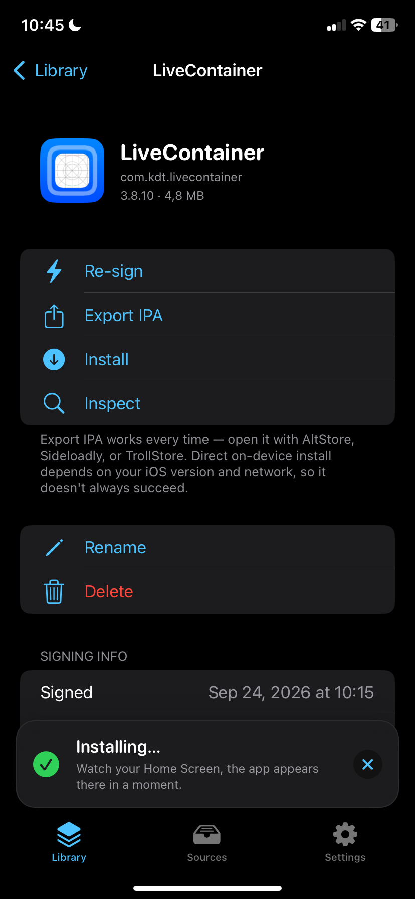
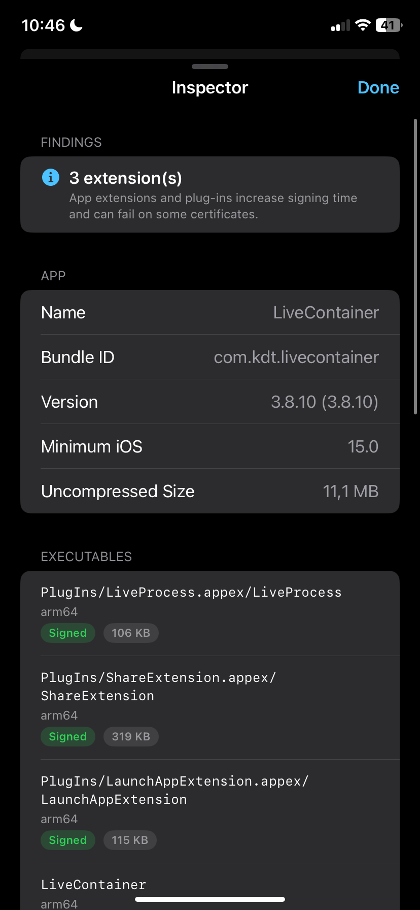
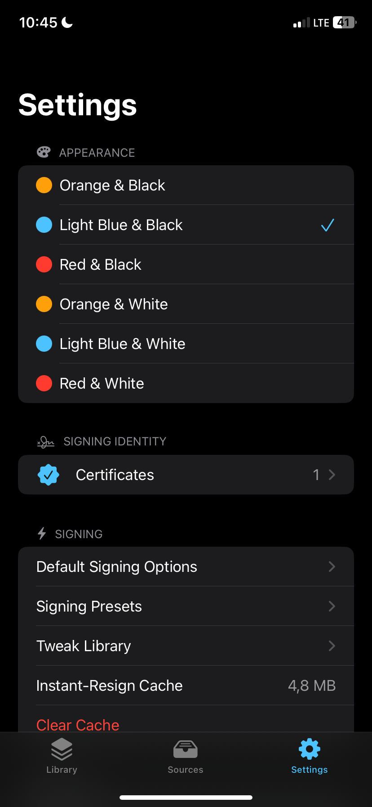
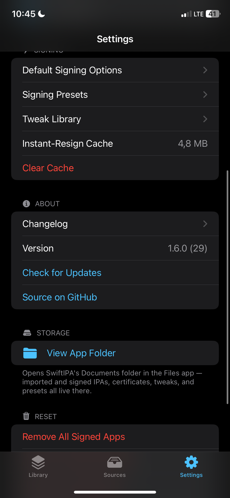

<div align="center">
  

  # SwiftIPA

  An IPA signer that runs on your iPhone.

  [](#)
  [](LICENSE)

</div>

I wanted a signer that feels quick and doesn't get in the way, so I built one. You add your own certificate and provisioning profile, pick an IPA and sign it right on your phone. The signing itself is done by [zsign](https://github.com/zhlynn/zsign), which is compiled into the app.

There's no account and no tracking. The app only goes online when you ask it to: downloading an IPA, loading a source, checking for updates, or installing (more on that below).

## Screenshots

<p align="center">
  
  
  
  
</p>

## Features

- Change the bundle ID, name, version, build, minimum iOS version, icon and entitlements
- Re-signing the same app with the same certificate and settings is almost instant, because the result gets cached
- Sign several apps in one go
- Save your favorite settings as presets
- Inject `.dylib` or `.deb` tweaks
- Remove extensions, the Watch app or the embedded profile, force file sharing, and a few more tweaks like that
- Add AltStore or ESign sources and pull apps from them
- See when a certificate is about to expire, with a reminder a few days before
- Look inside an IPA before signing it (architectures, encryption, linked libraries, extensions)
- Six color themes, English and German

## Installing apps

Tap Install on a signed app and a small bar at the bottom shows what's happening: preparing, waiting for you to confirm the iOS prompt, sending the app, installing. It works on Wi-Fi and on mobile data, and you don't need to install a profile or trust anything first.

How it works: iOS installs apps like this through `itms-services://`, but it only accepts the install manifest from a real HTTPS website. So the app runs a tiny server on your phone that hands out the IPA, and only the manifest (bundle ID, version and a link back to your phone) goes through [api.palera.in](https://api.palera.in), a small public service made for this. Your IPA never leaves your phone.

If you'd rather use something else to install, Export IPA gives you the signed file for AltStore, Sideloadly or TrollStore.

## Download

Every push to `main` builds a new unsigned IPA, see [Releases](https://github.com/xsxs18-dev/SwiftIPA/releases). Sign it once with whatever signer you use now, after that SwiftIPA can re-sign itself.

You can also add it as a source in AltStore, ESign or SwiftIPA itself:

```
https://raw.githubusercontent.com/xsxs18-dev/SwiftIPA/main/altstore-source.json
```

## Building it yourself

You need a Mac with Xcode, [XcodeGen](https://github.com/yonaskolb/XcodeGen) and your own signing certificate.

```bash
brew install xcodegen
git clone https://github.com/xsxs18-dev/SwiftIPA.git
cd SwiftIPA
./Scripts/fetch-dependencies.sh
xcodegen generate
open SwiftIPA.xcodeproj
```

The fetch script downloads zsign and the OpenSSL headers into `Vendor/`, which isn't checked in. The app talks to zsign through one small Objective-C++ file (`Signing/ZSign/ZSignBridge.mm`), everything else is Swift and SwiftUI.

## Known issues

- `.deb` tweaks only work if they're gzip-compressed. For `xz` or `zstd` ones, extract the `.dylib` and import that instead.
- Installing needs api.palera.in to be reachable. If it's down, use Export IPA for now.
- Revoked certificates are only detected through the profile and expiry date, the app doesn't ask Apple directly.
- The Share Sheet extension is English only.
- No special iPad layout yet.

Found a bug or have an idea? Open an issue, I read all of them.

## License

MIT, see [LICENSE](LICENSE).
